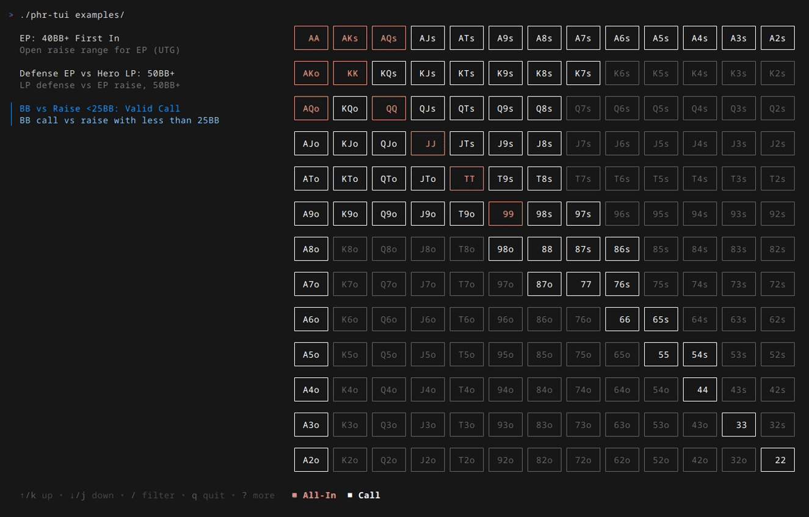

# Poker Holdem Ranges TUI

A terminal-based viewer for your custom Texas Hold'em poker ranges. Create your own range files and access them instantly with fast search and visualization in a 13x13 hand matrix.



[View demo](demo.gif)

## Features

- **Hand matrix** — Visual 13x13 grid with color-coded actions and legend
- **Range list** — Scrollable file browser with search/filter (`/`)
- **Details panel** — Strategic notes per range, shown alongside the grid
- **Grid cursor** — Navigate individual hands with `h/j/k/l`, arrows, or mouse click. The selected hand shows its action breakdown in a details panel on the right
- **Multi-tab ranges** — Define multiple stack-depth variations in a single file (e.g. 40BB+, 25-40BB, 12-25BB). Tabs inherit from a base and can add/remove hands. Switch with `Tab`/`Shift+Tab`
- **Opposite range** — Link your range to the opponent's range file. Press `Ctrl+O` to toggle and see what the villain is doing — useful for studying how your defense aligns against their opens
- **Legend filtering** — Click on a legend item to hide/show that action across all ranges. Useful for isolating specific actions to study
- **Mixed hands** — Hands with partial frequency (e.g. 50% raise, 50% call). Cell borders show a left-to-right color progression proportional to each action's frequency, with the remaining percentage shown in gray (fold)
- **Mouse support** — Click to select files in the list or hands in the grid
- **YAML configuration** — Simple, readable format with support for `raise_size`, mixed frequencies, tab inheritance, and opposite references

## Download

Go to [Releases](../../releases) and download the file for your system:

| System | File |
|--------|------|
| Linux | `phr-tui-linux` |
| macOS (M1/M2/M3) | `phr-tui-mac-m1` |
| macOS (Intel) | `phr-tui-mac-intel` |
| Windows | `phr-tui-windows.exe` |

### Linux / macOS

Open the Terminal and run:

```bash
# Make it executable
chmod +x phr-tui-*

# Run
./phr-tui-linux examples/
```

### Windows (PowerShell)

Open PowerShell and run:

```powershell
.\phr-tui-windows.exe examples\
```

### Windows (WSL)

Open WSL and run (uses Linux version):

```bash
chmod +x phr-tui-linux
./phr-tui-linux examples/
```

## Usage

Download the [examples](examples/) folder to test:

```bash
# Run with a directory (loads all .yaml files)
./phr-tui examples/

# Run with a specific file
./phr-tui examples/01_ep_first_in.yaml

# Run with custom title
./phr-tui --title "My Ranges" --title-color "#FF0000" examples/
```

### Controls

| Key | Action |
|-----|--------|
| `h/j/k/l` or `←↑↓→` | Navigate grid |
| `Ctrl+N` / `Ctrl+P` | Navigate list |
| `Tab` / `Shift+Tab` | Switch stack tab |
| `Ctrl+O` | Toggle opposite range |
| `Mouse click` | Select in list or grid |
| `Click legend` | Toggle action visibility |
| `/` | Search/filter |
| `q` or `Ctrl+C` | Quit |

## Range Configuration (YAML)

Each range is defined in a YAML file:

```yaml
title: "BTN vs CO 3-bet"
description: "BTN 3-bet range against CO open"
details: |
  Strategic notes:
  - 3-bet value with premium hands
  - 3-bet bluff with suited connectors
actions:
  - name: raise
    title: "3-bet Value"
    color: "#20bf55"
    hands:
      - AA
      - KK
      - QQ
      - AKs
      - AKo
```

### YAML Fields

| Field | Description |
|-------|-------------|
| `title` | Range name displayed in the TUI |
| `description` | Short description shown in the file list |
| `details` | Strategic notes shown in the details panel (use `\|` for multiline) |
| `actions` | List of actions with their hands |

### Action Fields

| Field | Description |
|-------|-------------|
| `name` | Internal identifier (not displayed) |
| `title` | Action name shown in the legend |
| `color` | Hex color for the hands (e.g. `#20bf55`) |
| `hands` | List of hands for this action |
| `raise_size` | Optional raise sizing label (e.g. `"2.5x"`, `"3x"`) |
| `add_hands` | Hands to add to the inherited action (only in `tab_ranges` with `base`) |
| `remove_hands` | Hands to remove from the inherited action (only in `tab_ranges` with `base`) |

### Hand Notation

- **Pairs**: `AA`, `KK`, `QQ`, ..., `22`
- **Suited**: `AKs`, `AQs`, `T9s` (same suit)
- **Offsuit**: `AKo`, `AQo`, `T9o` (different suits)

### Mixed Hands

When a hand has a mixed strategy (e.g. raise 50%, call 50%), you can assign the same hand to multiple actions with different frequencies. The cell border shows a left-to-right color progression proportional to each action's frequency. If the total doesn't reach 100%, the remaining portion is shown in gray representing fold.

The details panel shows the full breakdown when you hover the cursor over a mixed hand.

```yaml
actions:
  - name: raise
    title: "Raise"
    color: "#20bf55"
    hands:
      - AA
      - hand: AQo
        freq: 50    # Raise 50% of the time

  - name: call
    title: "Call"
    color: "#FFFFFF"
    hands:
      - hand: AQo
        freq: 50    # Call the other 50%
```

### Tab Ranges

Use `tab_ranges` to group multiple stack-depth variations in a single file. Each tab defines its own actions and details. Switch between tabs with `Tab` / `Shift+Tab`.

Tabs can **inherit** from a base tab using `base`. When inheriting, you only need to define what changes — use `add_hands` to include new hands and `remove_hands` to exclude hands from the inherited action. This avoids duplicating the entire range for each stack depth.

```yaml
title: "BTN First In (Multi-Stack)"
description: "BTN open range by stack depth"
tab_ranges:
  - tab: "40+"
    details: |
      BTN open 40BB+. Standard 2.5x raise.
    actions:
      - name: raise
        title: "Raise"
        color: "#20bf55"
        raise_size: "2.5x"
        hands: [AA, KK, QQ, JJ, TT, AKs, AQs, AKo]

  - tab: "25-40"
    base: "40+"              # Inherits all actions from "40+"
    details: |
      BTN open 25-40BB. Tighter raise, some shoves.
    actions:
      - name: raise
        add_hands: [A9s]     # Add A9s to the inherited raise range
        remove_hands: [TT]   # Remove TT (now goes all-in instead)
      - name: allin
        title: "All-In"
        color: "#FF8A80"
        hands: [TT]
```

### Opposite Range

Link your range to the opponent's range file so you can study both sides of a spot. For example, when viewing your BB defense range, you can press `o` to instantly see the BTN opening range you're defending against — without switching files.

The `file` field points to a YAML file in the same directory. Use `tab` to reference a specific tab when the opponent's file uses `tab_ranges`.

```yaml
title: "BB vs BTN Raise"
description: "BB defense vs BTN open"
opposite:
  file: "04_btn_first_in_tabs.yaml"   # Opponent's range file
  tab: "40+"                           # Specific tab (optional)
details: |
  BB defense vs BTN 2.5x open.
  Press Ctrl+O to see villain's opening range.
actions:
  - name: call
    title: "Call"
    color: "#FFFFFF"
    hands: [AJs, ATs, KQs, KJs, QJs, JTs, T9s, 99, 88, 77, 66, 55, 44]
  - name: reraise
    title: "3-bet"
    color: "#20bf55"
    hands: [AA, KK, QQ, JJ, TT, AKs, AKo]
```

When you press `Ctrl+O`, the grid switches to show the villain's range with an eye indicator on the tab bar. Press `Ctrl+O` again to return to your range.

### Recommended Color Palette

| Color | Hex | Usage |
|-------|-----|-------|
| Green | `#20bf55` | Raise, 3-bet value |
| Teal | `#06d6a0` | 3-bet aggressive |
| White | `#FFFFFF` | Call, Limp |
| Yellow | `#FFD166` | Bluff, 3-bet bluff, lesser value |
| Light Red | `#FF8A80` | All-in |
| Dark Red | `#cc2936` | All-in (alternative) |
| Pink | `#F48FB1` | All-in value (high equity) |
| Light Blue | `#90CAF9` | All-in fold equity |
| Orange | `#FF8800` | Table adjustments (no 3-bet, with ante) |
| Blue | `#4488FF` | Optional, situational |

## Suggested Config Organization

Organize your ranges in separate folders by category. Number the files to control the display order in the TUI:

```
ranges/
├── first-in/                    # Opening ranges
│   ├── 01_ep_40bb.yaml
│   ├── 02_mp_40bb.yaml
│   ├── 03_co_40bb.yaml
│   ├── 04_btn_40bb.yaml
│   └── 05_sb_40bb.yaml
└── defense/                     # Defensive ranges
    ├── 01_bb_vs_sb.yaml
    ├── 02_bb_vs_btn.yaml
    └── 03_co_vs_ep_3bet.yaml
```

Open multiple terminal tabs or use tmux to view different categories side by side:

```bash
# Terminal 1 / tmux pane 1
./phr-tui ranges/first-in/

# Terminal 2 / tmux pane 2
./phr-tui ranges/defense/
```

## Technologies

- [Bubble Tea](https://github.com/charmbracelet/bubbletea) - TUI framework
- [Lip Gloss](https://github.com/charmbracelet/lipgloss) - Styling
- [Bubbles](https://github.com/charmbracelet/bubbles) - UI components
- [Cobra](https://github.com/spf13/cobra) - CLI
- [VHS](https://github.com/charmbracelet/vhs) - Demo recording

## Contributing

Feature requests are welcome! Open an [issue](../../issues) to suggest new features or improvements.

If you find this tool useful, consider supporting the project:

[](https://github.com/sponsors/err0x1a)

## License

MIT
